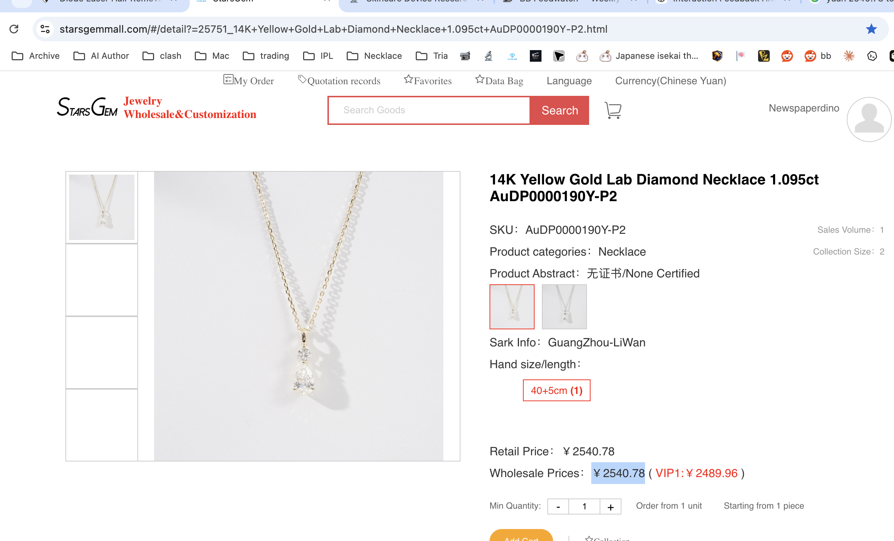
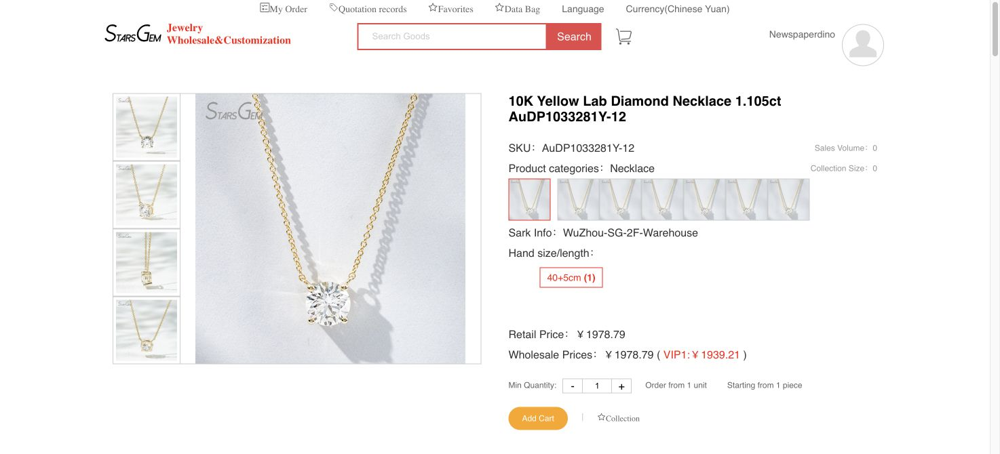
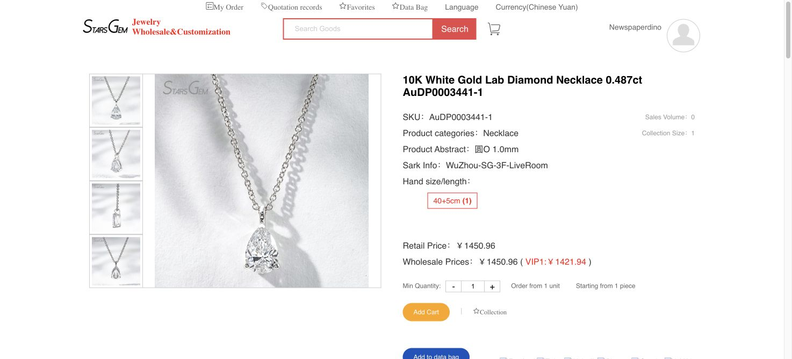
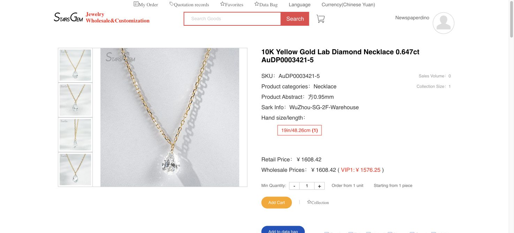
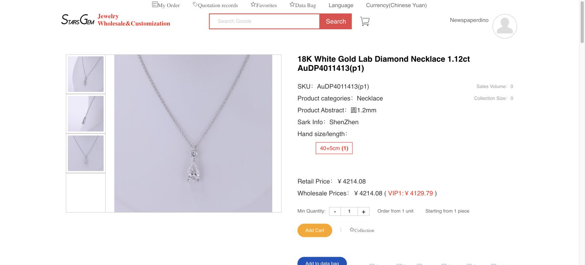

# 07 - StarsGem Listing Comparison and Currency Audit

Compiled: 2026-07-24

## Bottom line

Five StarsGem necklaces now form the direct supplier comparison set. The original 14K yellow-gold pear-and-round necklace remains the exact design reference. The strongest new design comparator is **AuDP4011413(p1)** because it repeats the pear-and-round layout with more finished weight, although it changes the metal to rhodium-plated 18K white gold and does not state an IGI report. The three certified 10K listings are useful price, chain, and stone-size benchmarks, but they are not like-for-like substitutes for the original 14K two-stone necklace. [1][2][3][4][5]

StarsGem is not performing a live CNY-to-USD conversion. Its currency selector uses approximately **6.19 CNY per USD**. The latest available IMF representative rate on 2026-07-23 was **6.7703 CNY per USD**, making the site's USD display approximately **9.37% higher** than a straight representative-rate conversion. [6]

## Price and conversion comparison

Method:

- **StarsGem USD** = listed CNY price divided by 6.19, the rate verified from the site's CNY and USD views.
- **Market-rate USD estimate** = listed CNY price divided by 6.7703, the IMF representative rate for 2026-07-23. [6]
- These figures exclude shipping, DAP duties/taxes, card or bank fees, certificate changes, CAD, and customization.

Machine-readable data: [starsgem_listings.csv](../data/starsgem_listings.csv).

Related decision guide: [14K vs 18K and Yellow vs White Gold](08_gold_alloy_color_guide.md).

| SKU | Listed CNY retail / VIP1 | StarsGem USD retail / VIP1 | Market-rate USD retail / VIP1 | Site uplift vs market-rate conversion |
|---|---:|---:|---:|---:|
| AuDP0000190Y-P2 | ¥2,540.78 / ¥2,489.96 | $410.47 / $402.26 | $375.28 / $367.78 | 9.37% |
| AuDP1033281Y-12 | ¥1,978.79 / ¥1,939.21 | $319.68 / $313.28 | $292.28 / $286.43 | 9.37% |
| AuDP0003441-1 | ¥1,450.96 / ¥1,421.94 | $234.40 / $229.72 | $214.31 / $210.03 | 9.37% |
| AuDP0003421-5 | ¥1,608.42 / ¥1,576.25 | $259.84 / $254.64 | $237.57 / $232.82 | 9.37% |
| AuDP4011413(p1) | ¥4,214.08 / ¥4,129.79 | $680.79 / $667.17 | $622.44 / $609.99 | 9.37% |

The repeated uplift shows a configured exchange-rate policy rather than rounding error. Ask StarsGem to state the final payable amount in both currencies and identify which currency the payment processor will actually charge.

## At-a-glance specification comparison

All specifications below are supplier-stated on the live listings as accessed 2026-07-24. “Approx. non-stone mass” is an inference calculated as gross product weight minus listed stone weight; it is **not** a guaranteed net-gold weight.

| SKU | Design | Metal / plating | Length | Diamonds | Gross weight | Approx. non-stone mass | Certificate status | Relevance |
|---|---|---|---|---|---:|---:|---|---|
| AuDP0000190Y-P2 | Round over pear | 14K yellow / no plating | 40+5 cm | 0.935 ct pear + 0.160 ct round; 1.095 ctw | 2.06 g | 1.841 g | None certified | Exact target design and primary baseline |
| AuDP1033281Y-12 | Round solitaire | 10K yellow / no plating | 40+5 cm | 1.105 ct round, 6.5–6.7 mm, CVD, DEF/VS | 1.67 g | 1.449 g | Listing states IGI 19J161052602 | Certified round-solitaire price floor; different design and lower-karat gold |
| AuDP0003441-1 | Pear solitaire | 10K white / rhodium plated | 40+5 cm | 0.487 ct pear, 4.5 × 6.5 mm, DEF/VS | 1.36 g | 1.263 g | Listing states IGI 77J062772510 | Small certified pear and white-gold benchmark |
| AuDP0003421-5 | Drilled floating pear | 10K yellow / no plating | Adjustable to 19 in / 48.26 cm | 0.647 ct pear, 5 × 7 mm, DEF/VS | 1.09 g | 0.961 g | Listing states IGI 59J521952508 | Lowest-metal, longest-chain comparison; specialized drilled construction |
| AuDP4011413(p1) | Round over pear | 18K white / rhodium plated | 40+5 cm | 1.02 ct pear + 0.10 ct round; 1.12 ctw | 2.79 g | 2.566 g | No report stated | Closest architecture and heaviest build; different color/karat and uncertified |

## Listing notes

### AuDP0000190Y-P2 — original 14K reference

- Supplier-stated: 14K yellow gold, no plating, 40+5 cm, 2.06 g gross, and 1.095 ctw.
- Pear: 0.935 ct, 5.3 × 8.3 mm, DEF/VS, CVD.
- Round: 0.160 ct, 3.4 mm, DEF/VS.
- Certificate: **None Certified**.
- Open construction question: the note “方1.0mm” may describe a 1.0 mm chain form or dimension, but its contract meaning remains unverified.
- Decision use: this is still the only exact 14K yellow-gold, two-stone baseline in the set. [1]

### AuDP1033281Y-12 — certified 1.105 ct round solitaire

- Supplier-stated: 10K yellow gold, no plating, solitaire series, 40+5 cm, 1.67 g gross.
- Diamond: one 1.105 ct CVD round, 6.5–6.7 mm, DEF/VS.
- Product description states **IGI report 19J161052602**.
- Decision use: it is the least expensive near-1.1 ct certified listing and therefore a useful check on the cost of certification and a single round stone. It does not reproduce the target's pear shape or accent-round geometry. [2]

### AuDP0003441-1 — certified 0.487 ct pear solitaire

- Supplier-stated: 10K white gold, rhodium plated, solitaire series, 40+5 cm, 1.36 g gross.
- Diamond: one 0.487 ct pear, 4.5 × 6.5 mm, DEF/VS.
- Product description states **IGI report 77J062772510**.
- “圆O 1.0mm” appears to be a chain-style or chain-dimension note, but StarsGem should translate it and provide caliper measurements before it is treated as a specification.
- Decision use: a small certified pear benchmark; the stone is roughly half the original pear's carat weight and the metal is lower-karat, rhodium-plated white gold. [3]

### AuDP0003421-5 — certified drilled floating pear

- Supplier-stated: 10K yellow gold, no plating, adjustable to 19 in / 48.26 cm, 1.09 g gross.
- Diamond: one 0.647 ct pear, 5 × 7 mm, DEF/VS.
- Product description states **IGI report 59J521952508** and describes a drilled or “punching diamond” floating construction.
- “方0.95mm” is not a sufficiently clear chain specification.
- Decision use: useful if the floating look is desirable, but it is not a prong-set substitute. Ask for close-up video of the drilled area, the attachment method, movement at the hole, and written chip/remake coverage. Its approximately 0.961 g inferred non-stone mass is the lightest in the set. [4]

### AuDP4011413(p1) — 18K white pear-and-round comparator

- Supplier-stated: 18K white gold, rhodium plated, 40+5 cm, 2.79 g gross.
- Pear: 1.02 ct, 5.5 × 9 mm, DEF/VS, CVD.
- Round: 0.10 ct, 3.0 mm, DEF/VS.
- Total: 1.12 ctw. No IGI report is stated.
- “圆1.2mm” likely relates to a round 1.2 mm chain, but it remains a translation/caliper question.
- Decision use: this is the strongest construction and price comparator for the original design. It has 0.73 g more gross weight and a larger pear than the 14K reference, but changes to 18K rhodium-plated white gold and uses a smaller accent round. Ask StarsGem to quote this build in 14K yellow gold before assuming that the ¥4,214.08 price applies to a yellow-gold version. [5]

## Comparative conclusions

1. **Best exact match:** AuDP0000190Y-P2 remains the target because it alone matches 14K yellow gold plus the 0.935 ct pear and 0.160 ct round layout.
2. **Best construction benchmark:** AuDP4011413(p1) provides the strongest evidence that StarsGem can make the same architecture with a 1.2 mm-class chain note and 2.79 g gross weight. It is the most useful basis for requesting a heavier 14K yellow-gold version.
3. **Best certification-price benchmark:** AuDP1033281Y-12 shows a supplier-stated IGI number on a 1.105 ct CVD round at a lower CNY price than the uncertified original. Shape, setting complexity, and metal weight prevent a direct value conclusion, but it weakens any claim that certification alone must add several hundred dollars.
4. **Best smaller-pear benchmarks:** AuDP0003441-1 and AuDP0003421-5 show how StarsGem prices certified 0.487–0.647 ct pears in light 10K builds. They should not anchor a quote for the heavier 14K two-stone necklace.
5. **Currency recommendation:** negotiate from the CNY figures, ask for the merchant's USD rate and payment currency in writing, and compare the final processor total rather than trusting the site's currency toggle.

## Questions to add to the StarsGem RFQ

- Please quote all five SKUs in both CNY and USD and state the exchange rate used.
- Can AuDP4011413(p1) be made in unplated 14K yellow gold with the original 0.16 ct round, while keeping at least 2.79 g gross weight and the stated 1.2 mm chain?
- For the three listings that print IGI numbers, please provide the digital reports and confirm that each number belongs to the exact stone that will ship—not a sample or prior unit.
- Are the printed IGI numbers loose-diamond reports or finished-jewelry reports, and can the inscription be shown in a pre-shipment video?
- Translate “方1.0mm,” “圆O 1.0mm,” “方0.95mm,” and “圆1.2mm” into the factory chain code, measured width, measured thickness, link dimensions, and chain-only weight.
- Confirm whether the listed gross weights are guaranteed minimums or sample/average weights.
- For AuDP0003421-5, provide the drilled-hole diameter, attachment method, close-up video, and written remedy if the diamond chips around the hole.
- State stock status, production lead time, shipping, DAP/duty handling, payment fee, return/remake terms, and final landed total separately.

## Evidence gaps

- The three printed IGI numbers were observed on StarsGem's listings but were not independently matched to digital reports during this research pass. Verify them through IGI before purchase. [7]
- “Approx. non-stone mass” is a calculation, not a supplier declaration of net gold weight.
- Site prices and availability can change; recheck them immediately before requesting or approving an invoice.
- The representative-rate USD amounts are analytical comparisons, not executable bank or card quotes.
- The listings do not disclose shipping, duties, card/bank spreads, stock reservation, or order-specific remedies.

## Sources

1. StarsGem, AuDP0000190Y-P2 live listing, accessed 2026-07-24. <https://starsgemmall.com/#/detail?=25751_14K+Yellow+Gold+Lab+Diamond+Necklace+1.095ct+AuDP0000190Y-P2.html> — primary supplier source for the original 14K two-stone specifications and CNY price.
2. StarsGem, AuDP1033281Y-12 live listing, accessed 2026-07-24. <https://starsgemmall.com/#/detail?=21313_10K+Yellow+Lab+Diamond+Necklace+1.105ct+AuDP1033281Y-12.html> — primary supplier source for the 10K yellow round-solitaire specification, price, and printed IGI number.
3. StarsGem, AuDP0003441-1 live listing, accessed 2026-07-24. <https://starsgemmall.com/#/detail?=23401_10K+White+Gold+Lab+Diamond+Necklace+0.487ct+AuDP0003441-1.html> — primary supplier source for the 10K white pear-solitaire specification, price, and printed IGI number.
4. StarsGem, AuDP0003421-5 live listing, accessed 2026-07-24. <https://starsgemmall.com/#/detail?=22908_10K+Yellow+Gold+Lab+Diamond+Necklace++0.647ct+AuDP0003421-5.html> — primary supplier source for the drilled floating-pear specification, price, and printed IGI number.
5. StarsGem, AuDP4011413(p1) live listing, accessed 2026-07-24. <https://starsgemmall.com/#/detail?=22081_18K+White+Gold+Lab+Diamond+Necklace+1.12ct+AuDP4011413(p1).html> — primary supplier source for the 18K white two-stone specification and price.
6. International Monetary Fund, Representative Exchange Rates for Selected Currencies for July 2026. <https://www.imf.org/external/np/fin/data/rms_mth.aspx?reporttype=rep> — reports 6.7703 Chinese yuan per U.S. dollar for 2026-07-23; 2026-07-24 was not yet populated when accessed.
7. International Gemological Institute, report lookup. <https://lookup.igi.org/> — official destination for independently checking the printed report numbers.
